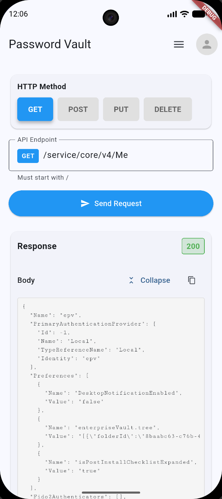
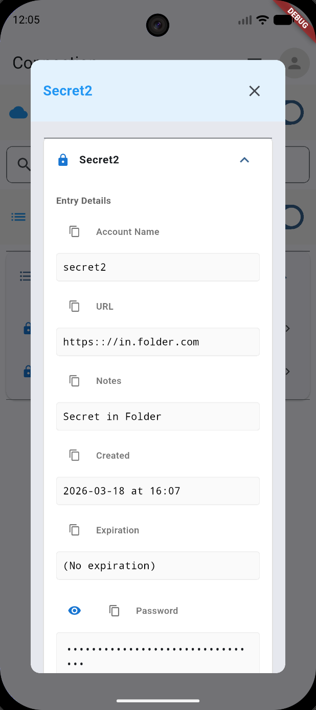
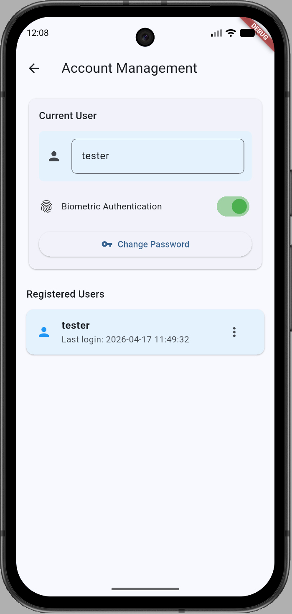
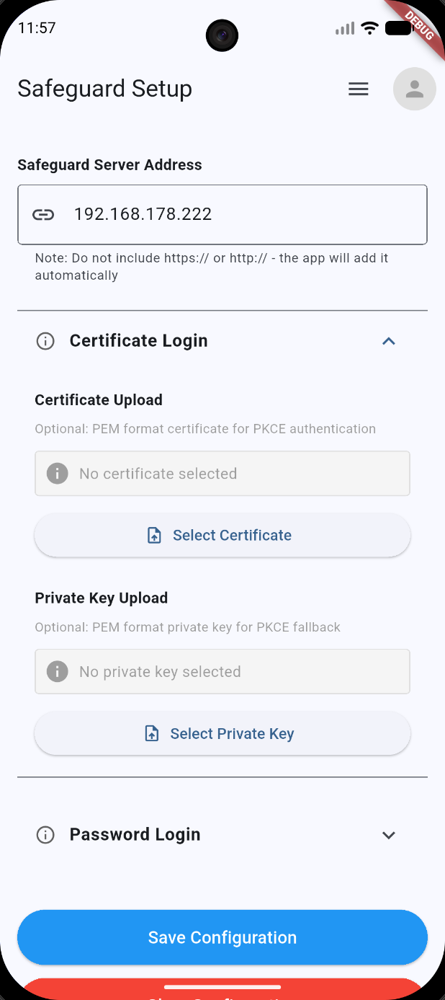
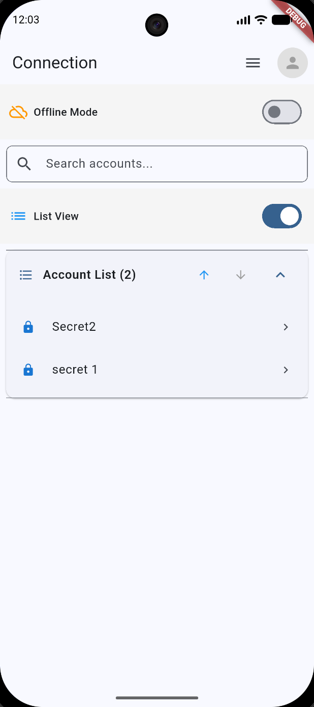
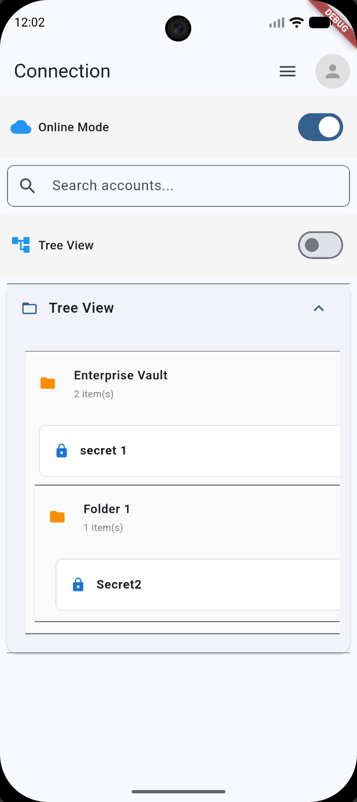
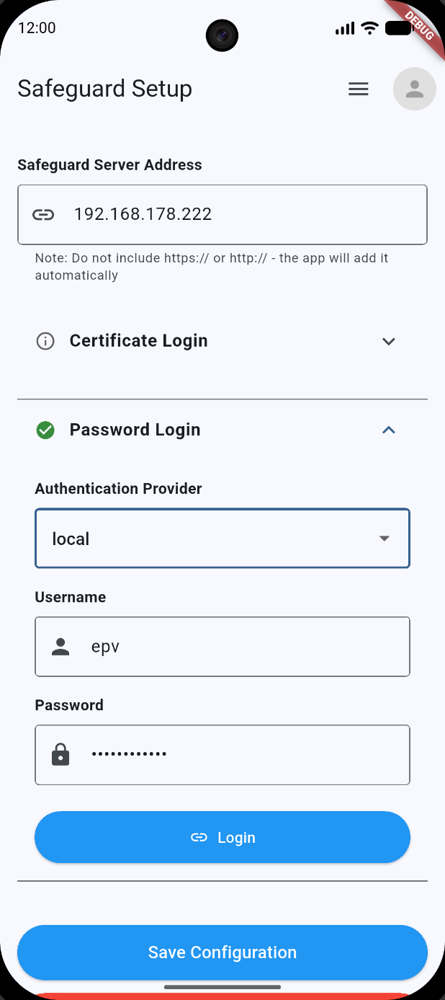
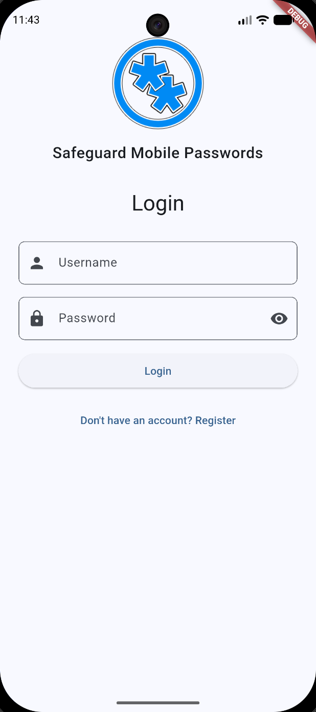

# Mobile Password Client for Safeguard 

A Flutter application for secure account and password management with One Identity Safeguard for Privileged Passwords integration.

## Disclaimer

This app is provided as-is with no support. This is a private project and has not releation to One Identity or is an official One Identity product, except that the app requires access to an instance of the Safeguard Privileged Passwords appliance. 

## Overview

This repository contains a cross-platform Flutter app that helps users manage accounts, passwords, and API requests using secure local storage, encryption, and biometric authentication.

Key features:
- Secure account authentication and session handling
- Password vault and account management screens
- Local encrypted storage using `flutter_secure_storage` and `sqflite`
- Biometric login support via `local_auth`
- WebView integration and certificate handling
- Support for Android, iOS, macOS, Windows, and Linux

## Getting Started

### Prerequisites
- Flutter SDK 3.11.3 or newer
- Git
- Android Studio / Xcode / Visual Studio for platform-specific tooling

### Install dependencies

```bash
flutter pub get
```

### Run the app

```bash
flutter run
```

To target a specific platform:

```bash
flutter run -d chrome
flutter run -d android
flutter run -d ios
flutter run -d windows
flutter run -d macos
flutter run -d linux
```

## Build

Android APK:

```bash
flutter build apk --release
```

iOS archive:

```bash
flutter build ios --release
```

macOS build:

```bash
flutter build macos --release
```

Windows build:

```bash
flutter build windows --release
```

Linux build:

```bash
flutter build linux --release
```

## Project Structure

- `lib/` - main application code
  - `main.dart` - app entry point
  - `models/` - data model definitions
  - `screens/` - UI screens and navigation
  - `services/` - backend, storage, and security services
- `assets/` - app assets and images
- `android/`, `ios/`, `windows/`, `macos/`, `linux/` - platform-specific projects

## Dependencies

Main dependencies used by the app:
- `flutter_secure_storage`
- `sqflite`
- `local_auth`
- `webview_flutter`
- `dio`
- `http`
- `encrypt`
- `pointycastle`
- `file_picker`
- `intl`

- requires access to an instance of the "One Identity Safeguard Privileged Password" appliance

## Notes

- The package is currently configured with `publish_to: 'none'` in `pubspec.yaml`.
- Customize `assets/images/` and configuration files before publishing.

## Screenshots

| Screenshot | Screenshot |
| --- | --- |
| <div align="center"><br/>APITest.png</div> | <div align="center"><br/>AccountDetails.png</div> |
| <div align="center"><br/>AccountManagement.png</div> | <div align="center"><br/>CertificateSetup.png</div> |
| <div align="center"><br/>CreateAccount.png</div> | <div align="center"><br/>LoginScreen.png</div> |
| <div align="center"><br/>OfflineListView.png</div> | <div align="center"><br/>OnlineTreeView.png</div> |
| <div align="center"><br/>PasswordSetup.png</div> | <div align="center"><br/>SafeguardSetup.png</div> |

## License

- `lib/` - main application code
  - `main.dart` - app entry point
  - `models/` - data model definitions
  - `screens/` - UI screens and navigation
  - `services/` - backend, storage, and security services
- `assets/` - app assets and images
- `android/`, `ios/`, `windows/`, `macos/`, `linux/` - platform-specific projects

## Dependencies

Main dependencies used by the app:
- `flutter_secure_storage`
- `sqflite`
- `local_auth`
- `webview_flutter`
- `dio`
- `http`
- `encrypt`
- `pointycastle`
- `file_picker`
- `intl`

- requires access to an instance of the "One Identity Safeguard Privileged Password" appliance

## Notes

- The package is currently configured with `publish_to: 'none'` in `pubspec.yaml`.
- Customize `assets/images/` and configuration files before publishing.

## License

Add your license information here if you want to open source the project.
